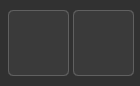
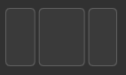
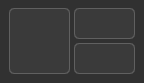
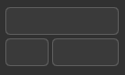

# kzones-config

[KZones](https://github.com/gerritdevriese/kzones) is a KWin script for snapping windows into zones. However, its configuration is a bit cumbersone. This CLI tool provides a much shorter way of defining layouts.

# Installation

## via `cargo`

```
cargo install kzones-config
```

# Usage

`kzones-config --input <CONFIG_FILE>` prints a JSON config on a standard output. That should be pasted into KZones' settings, in a `Layouts` tab. Remember to restart KZones after changing its configuration

## Input file

Input file is a TOML file that looks like this
```toml
padding = 10

[layouts]
layout_name = "horizontal(1,1)"
```

`padding` field defines padding that will be set for all layouts. `layouts` is a mapping between names of layouts and its descriptions, in layout definition format.

See `examples/config.toml` for an example input file.

## Layout definition format

### Simple layouts

A __split__ is defined as `<direction>(<1st_node>, <2nd_node>, ...)`, where `direction` can be either `horizontal` or `vertical`. Each node is described by a number. Numbers describes a ratio between sizes of zones. 

For example, `horizontal(1, 2, 1)` will create three arenas:
* first one will take first 25% of the screen on the left,
* second one will take 50% in the center,
* third one will take 25% on the right.

`horizontal`/`vertical` can be abbreviated as `h`/`v`.

### Nested layouts

We can further split nodes by adding a `:` after number and specifying another split.

For example, `horizontal(1, 2: vertical(2, 3), 1)` will create __four__ areas:
* first one taking 25% of the screen on the left,
* second one located horizontally in the middle, at the top, taking 40% of vertical space
* third one also located horizontally in the middle, taking remaining 60% of vertical space at the bottom,
* last one taking 25% of the screen on the right.

There is no limit on level of layout nesting.

## Examples

### `horizontal(1, 1)`



### `horizontal(2, 3, 2)`



### `horizontal(2, 1: vertical(1, 1))`



### `vertical(2, 3: horizontal(2, 3))`



# To be done
- preserve order of layouts, as defined in a input file,
- allow overriding padding per-layout (in TOML, not as an extension of layout definition format),
- allow setting value of `application` setting of a layout (in TOML, not as an extension of layout definition format),
- apply changes to KZones automatically, without a need of manually copying generated config.